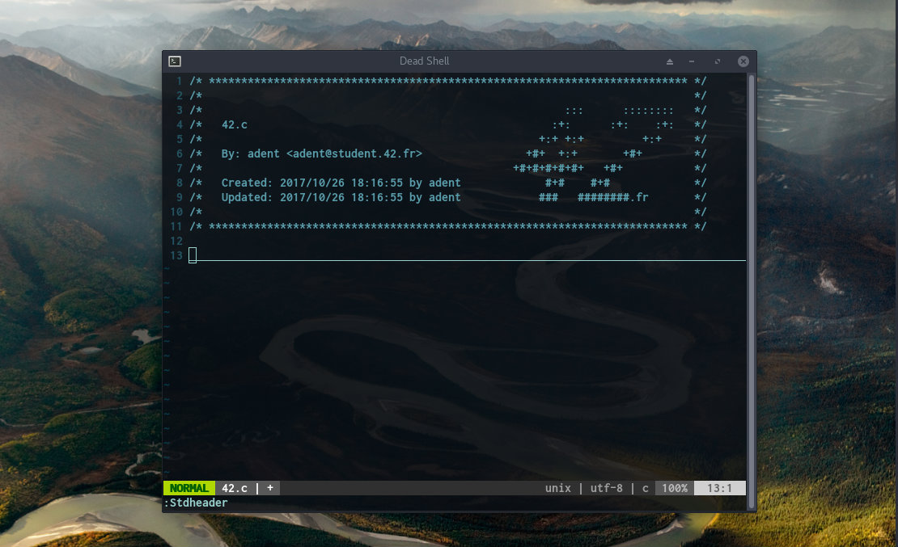

# **42 Header**

42 (Paris)

### **Description**

42 standard header for vim editor.



### **UNIX Setup**

Copy `stdheader.vim` in your `~/.vim/plugin`, or use your favorite plugin
manager. Then set the user and mail variables as explained below.

#### Option 1: export USER and MAIL in your shell configuration file

Add in `~/.zshrc` your:

+ `USER`
+ `MAIL`

#### Option 2: set user and mail values directly in your vimrc

```vim
let g:user42 = 'yourLogin'
let g:mail42 = 'yourLogin@student.42.fr'
```

### **Usage**

In **NORMAL** mode you can use `:Stdheader` or simply press the shortcut <kbd>F1</kbd>.

Under **Linux** you eventually need to disable the **help** shortcut of your **terminal** :

For **Terminator**, right click -> Preferences -> Shortcuts -> change help with something other than <kbd>F1</kbd>

### **Note**

Inside the **42 clusters** you can easily run:

`$ ./set_header.sh`

### **Credits**

[@zazard](https://github.com/zazard) - creator  
[@alexandregv](https://github.com/alexandregv) - contributor  
[@mjacq42](https://github.com/mjacq42) - contributor  
[@sungmcho](https://github.com/lordtomi0325) - contributor  

### **License**

This work is published under the terms of **[42 Unlicense](https://github.com/gcamerli/42unlicense)**.
